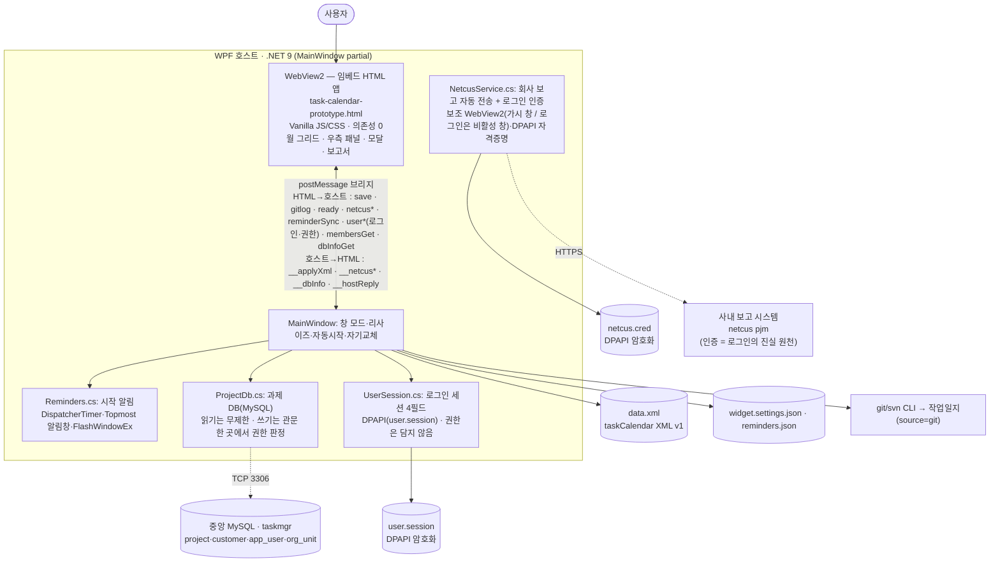

<div align="center">

# 📅 수행과제 캘린더 · TaskCalendar

**바탕화면에 상주하는 오프라인 데스크톱 캘린더 위젯 — 과제별 git/svn 커밋으로 일/주 보고서를 만들고, 사내 보고 시스템 자동 작성과 일정 시작 알림까지**

[](#-릴리스-내역)
[](#)
[](#)
[](#)
[](#)
[](#-테마)
[](#-접근성--키보드)
[](LICENSE)
[](https://github.com/Peace-Min/task-calendar/issues/new)


</div>

> [!IMPORTANT]
> **🐞 버그 · 불편한 점 · 개선 제안은 [Issues](https://github.com/Peace-Min/task-calendar/issues/new)에 등록해 주세요.**
> 쓰다가 깨지는 부분, "이런 기능이 있었으면" 싶은 점 — 무엇이든 이슈로 남겨주시면 확인하고 우선순위를 매겨 반영합니다.

---

## 목차
- [소개](#소개)
- [주요 기능](#-주요-기능)
- [시작하기](#-시작하기)
- [사용법](#-사용법)
- [로그인 · 권한 · 구성원](#-로그인--권한--구성원)
- [회사 보고 연동 (netcus)](#-회사-보고-연동-netcus)
- [일정 시작 알림](#-일정-시작-알림)
- [테마](#-테마)
- [아키텍처 / 구조](#️-아키텍처--구조)
- [데이터 / 설정 파일](#️-데이터--설정-파일)
- [접근성 · 키보드](#️-접근성--키보드)
- [릴리스 내역](#-릴리스-내역)
- [로드맵](#️-로드맵)
- [이슈 · 피드백](#-이슈--피드백)
- [라이선스](#-라이선스)

---

## 소개

**수행과제 캘린더**는 인터넷 없이 동작하는 Windows 데스크톱 캘린더 위젯입니다. "수행 과제"를 카테고리로 두고 일정·할 일·근태를 기록하며, 과제별 로컬 **git 저장소의 내 커밋을 끌어와 작업일지**로 만들고, 기간을 골라 **보고서(일간/주간) 초안**을 뽑은 뒤 **사내 보고 시스템에 자동 작성**까지 합니다. 시작시각이 있는 일정은 **시작 전 알림**으로 챙겨줍니다. 데이터는 어디서든 읽기 쉬운 **XML**로 저장됩니다.

- 🔒 **완전 오프라인** — 외부 리소스·CDN·네트워크 호출 0개. 폐쇄망(망분리)에서 그대로 동작.
- 🖥️ **두 가지 창 모드** — 바탕화면 최하위 위젯(기본) ↔ 일반 앱 창(작업표시줄·Alt+Tab·트레이). ⚙에서 전환.
- 🧾 **보고서 자동화** — 과제별 git·svn 커밋 → 작업일지 → 일간/주간 보고서 초안 → **회사 시스템 자동 작성/전송**.
- ⏰ **시작 알림** — 시작시각 일정 1시간 전부터 60→30→10→5분 에스컬레이션(무음·폐쇄망 대응).
- 🎨 **테마 6종 + 다크** — 라이트·다크·포레스트·세피아·고대비·시스템. 단색 SVG 아이콘이 currentColor로 전 테마 자동 적응.
- 🐞 **사내 문의 동선** — 앱 상단 문의 버튼에서 버그·개선사항 접수처(`phmin@netcus.com` / 랜메신저 민평화)를 바로 확인.
- 🗂️ **개방형 데이터** — `taskCalendar` XML v1. 내보내기/가져오기로 백업·이전.
- ♿ **접근성(WCAG AA)** — 월 그리드 키보드 내비, 모달 포커스 트랩·복원, ARIA 탭/그리드, 가시 포커스 링.

> 단일 HTML(`task-calendar-prototype.html`)을 **그대로 본체로 임베드**해 WPF + WebView2 위젯으로 패키징합니다. 브라우저에서 HTML만 열어도 동일하게 동작합니다(데이터는 localStorage).

> 📖 **사용 방법**: [USAGE.md (사용 설명서)](USAGE.md) · 📄 **이어서 작업**: [CHANGELOG.md](CHANGELOG.md)(인계 문서) · 📐 **명세**: [SPEC.md](SPEC.md)

## ✨ 주요 기능

- 🏷️ **수행 과제 관리** — 생성/수정/삭제, 색상, 과제별 **git/svn 저장소(작업복사본) 경로** 연결
- 🗓️ **월간 캘린더** — 월/연·월 점프, 양력 공휴일, 오늘 강조, **기간(다일) + 반복(매주/매월) 일정**(연속 막대·겹침 레인), **월 보기 밀도 3모드**(고정/촘촘히/펼침)
- ⚡ **한 줄 빠른 캡처** — 일정/할 일 토글 + 제목 + 날짜 + 과제(+옵션 더보기). 시작시각은 **시·분 분리 드롭다운**
- 🧩 **우측 패널 탭** — `[일정 상세 | 할 일 | 커밋 내역]`, 셋 다 **선택한 날짜**를 따라감. 좁은 폭에선 하단 시트
- ✅ **할 일(TODO)** — ★중요·완료 섹션·기한/기간, 캘린더에 **속 빈 링 칩**(일정 막대와 모양 구분, 색맹 안전)
- 🔧 **Git/SVN 커밋 → 작업일지** — 과제별로 **Git 또는 SVN** 선택(.git/.svn 자동 감지) → 저장소에서 `내 커밋`을 끌어와 구조화 기록(단건·기간 일괄). SVN은 TortoiseSVN/SlikSVN `svn.exe` 사용
- 📋 **보고서(2단 레이아웃)** — **일간 작성 / 주간 작성 / 기간 취합** → 넓게 보기는 **좌 옵션·우 미리보기**, 좁으면 **⚙ 옵션 접기**. 과제별 `[과제명] : 시간` + 업무 불릿 초안 → 복사/저장. 포함 항목·**머리기호(개요)**·들여쓰기 선택. 커밋·할 일·일정 항목은 미리보기에서 바로 편집
- 🔐 **회사 계정 로그인 · 계정별 편집 권한** — 시작 시 netcus 계정으로 1회 로그인(세션 유지), 과제 DB 편집 가능 여부는 `app_user`가 **요청 시점**에 판정. 👤 **사용자 정보**에서 내 권한·구성원 명부 확인 ([아래](#-로그인--권한--구성원))
- 🗄️ **과제 DB 연동** — 사업부 공식 과제 마스터(발주처·구분·상태·계약기간)를 중앙 MySQL에서 읽고 관리, Excel 장표 추출
- 🏢 **회사 보고 자동 작성** — 일간보고 자동 전송 · 주간보고 폼 자동 채움 · **주간을 netcus 일간보고 병합으로 생성** · **기간 취합으로 netcus 주간보고들을 과제별 진행사항 병합**(내용 출처 = 캘린더 기록 · netcus 일간 · netcus 주간) ([아래](#-회사-보고-연동-netcus))
- 🕘 **근태 · 초과시간** — 일간 보고서에 근태(정근/야근/특근/외근/출장/휴가/반차/조퇴/지각/병가)·초과시간 기록
- 🚪 **회의실 관리** — 자주 쓰는 회의실 등록/편집, 일정 장소를 빠른 선택
- ⏰ **일정 시작 알림** — 에스컬레이션 + 테마별 카드 ([아래](#-일정-시작-알림))
- 🔍 검색 / 과제별 모아보기 · 🧲 드래그 이동 · ↔️ 너비 조절 · 🔳 넓게 보기
- 🎨 **테마 6종** · 단색 SVG 아이콘 시스템 · 토스트+되돌리기 · 부팅 스켈레톤
- 💾 **XML 내보내기/가져오기**, 자동 시작(첫 실행 1회 질문, 경로 자가 치유), **새 빌드 우아한 자기교체**

## 🚀 시작하기

> **사전 요구**: **.NET 9 SDK**(또는 .NET 9 지원 **Visual Studio 2022 17.12+**). 폐쇄망이면 [.NET 9 SDK 오프라인 설치본](https://dotnet.microsoft.com/download/dotnet/9.0)(x64)을 USB로 반입해 1회 설치. WebView2 NuGet은 동봉되어 오프라인 복원됩니다.

### ① 직접 빌드
```powershell
# 프레임워크 종속(대상 PC에 .NET 9 런타임 필요, 빠름)
dotnet publish widget\TaskCalendarWidget.csproj -c Release -o dist\app

# 자체포함 단일 exe(런타임 불필요, ~163MB) — 인터넷+런타임팩 캐시 있는 빌드 PC에서
dotnet publish widget\TaskCalendarWidget.csproj -c Release -r win-x64 --self-contained true `
  -p:PublishSingleFile=true -p:IncludeNativeLibrariesForSelfExtract=true -o dist\portable
```
- 결과 실행 → 바탕화면 위젯 시작. 배포/시작프로그램/단일 exe 상세는 **[DEPLOY.md](DEPLOY.md)**.

### ② 브라우저로 바로 써보기 (빌드 없이)
- `task-calendar-prototype.html`을 더블클릭해 Edge로 열면 그대로 동작(오프라인, 데이터는 localStorage). 단, 회사 보고 전송·시작 알림 등 **호스트 기능은 위젯(앱)에서만** 동작.

## 📖 사용법

자주 쓰는 동작 요약 — 전체 설명·단축키·FAQ는 **[USAGE.md](USAGE.md)**.

| 동작 | 방법 |
|---|---|
| 새 일정/할 일 | 날짜 더블클릭 · 우측 **＋ 추가** · 상단 **＋ 새 기록** → **빠른 캡처**(일정/할일 토글) |
| 상세(반복·시간·기간·장소·메모) | 빠른 캡처 **옵션 더보기**, 또는 칩 클릭 → 편집 |
| 우측 패널 전환 | `[일정 상세 / 할 일 / 커밋 내역]` 탭 — 모두 선택한 날짜 기준 |
| 커밋 가져오기 | **커밋 내역 탭**의 `이 날 커밋` / `기간 일괄` (과제에 git/svn 경로 연결, 위젯 전용) |
| 보고서 | 우측 **📋 보고서** → **일간 작성 / 주간 작성 / 기간 취합** 탭 → 복사/저장 |
| 회사 보고 전송 | 보고서 모달에서 **일간(오늘)→📤 일간보고 전송** / **주간(이번 주)→📤 주간보고 작성** (시작 시 로그인 필요) |
| 내 정보 · 권한 · 구성원 | 상단 **👤 사용자 정보** → 신원·권한 확인 · 로그아웃 · **구성원 보기**(조직 트리) |
| 시작 알림 켜기/끄기 | 일정마다 폼의 **미리알림** 행(없음 / 놓침 방지 / 직접) — 전역 스위치는 없습니다 |
| 회의실 · 월 밀도 · 테마 | ⚙(설정) / 🎨(테마) / ⋯ → 회의실 관리 |
| 창 모드 전환 | ⚙ → **트레이 아이콘 사용**(켜면 작업표시줄·Alt+Tab / 끄면 바탕화면 위젯) |
| 백업/이전 | ⋯ → **XML 내보내기 / 가져오기** |

## 🔐 로그인 · 권한 · 구성원

v0.17.0부터 **회사 계정(netcus)으로 로그인**합니다. 위젯(앱) 전용이며, 브라우저 단독 실행에서는 로그인 화면이 뜨지 않습니다(netcus에 CORS 헤더가 없어 원천 불가 — 차단하면 영구히 잠깁니다).

- **시작 시 1회 로그인 → 세션 유지**: 인증(정말 본인인가)은 **netcus**가, 인가(이름·소속·권한)는 **과제 DB의 `app_user`** 가 맡습니다. 세션은 이 PC에 **DPAPI로 암호화**(`user.session`)되며 `loginId·name·title·orgUnit` **4필드만** 담습니다. 권한은 담지 않습니다.
- **편집 권한은 계정으로 판정**: 과제 DB를 고칠 수 있는지는 **쓰기를 요청하는 시점**에 호스트가 `app_user.edit_role`·`is_active`로 판정합니다. 화면이 캐시한 역할로 미리 막지 않습니다 — 그 캐시는 낡는 순간 반드시 틀립니다. 거부 사유(`편집 권한이 없습니다` / `비활성 처리된 계정입니다` 등)를 그대로 알려줍니다.
  - 이전의 **공용 관리자 비밀번호는 폐지**됐습니다(v0.17.0). 설정창의 「관리자」 인증 칸도 함께 사라졌습니다.
- **「사용자 정보」(상단바 👤)**: 내 이름·직급·소속과 **지금 내 권한**을 봅니다. 권한은 **열 때마다 서버에서 새로** 읽습니다(세션에 캐시하지 않음 — 관리자가 바꾸면 바로 반영). 로그아웃도 여기서 합니다.
- **구성원 명부**: 「사용자 정보 → 구성원 보기」에서 조직 트리를 따라 사람을 봅니다. **명부와 조직 트리는 전 직원·전 조직**입니다 — 이름·직급·소속은 사내 인트라넷에 이미 공개된 정보라 감추지 않습니다.
  - 계정의 `view_scope`(`self` / `unit_tree` / `all`)가 정하는 것은 **「그 사람의 *일정*을 볼 수 있는가」** 뿐입니다. 범위 밖 사람의 행은 **누를 수 없는 줄**로 나옵니다(명부에서는 빠지지 않습니다).
  - 사람을 누르면 **그 사람 일정 보기**가 열릴 자리입니다 — 아직 **준비 중**입니다(일정이 DB로 올라간 뒤).

> **배포 선행조건**: 이 기능은 과제 DB에 `app_user`·`org_unit`·`title_code`(+ `taskmgr_app` SELECT 권한)가 갖춰져 있어야 동작합니다. 없으면 로그인 게이트를 넘지 못합니다. 사원 데이터는 이 저장소가 아니라 별도 비공개 저장소에서 관리합니다.

## 🏢 회사 보고 연동 (netcus)

사내 보고 시스템(**netcus pjm**)에 보고서를 **자동 작성**합니다. 위젯(앱) 전용 기능이며, 회사 도메인이 열린 환경에서 동작합니다.

- **자격증명**: v0.17.0부터 **시작 시 로그인이 단일 출처**입니다. 설정창의 ID/비밀번호 입력칸은 사라졌고, 로그인할 때 받은 자격을 이 PC에 **DPAPI로 암호화**해 보관(`netcus.cred`)했다가 보고 전송에 재사용합니다. **앱은 비밀번호를 평문 저장하지 않습니다.** (자격 출처가 하나라 "세션은 나, 보고는 남" 불일치가 구조적으로 불가능합니다.)
- **일간보고**: 보고서 일간 탭 → `📤 일간보고 전송`. 보조 창에서 자동 로그인 → 그 날짜 입력 → 근태/초과/내용 작성. **미제출 테스트**(채움까지만 확인) / **실제 제출**(POST) 모드.
- **주간보고**: 주간 탭 → `📤 주간보고 작성`. 기간·제목·과제투입시간·진행사항을 작성 폼에 자동으로 채우고 창을 띄움 → 차주계획 등 보완 후 직접 제출.
- **주간보고 — 내용 출처 선택**: 주간 작성에서 **캘린더 기록**(이 앱 정리분) 또는 **netcus 일간보고 병합**(그 주 사이트에 제출한 일간보고를 읽어 **과제별 재취합 + 시간 합산**) 중 선택. netcus 병합본은 **읽기전용**(수정은 netcus 일간에서), 형식 벗어난 항목은 `[미분류]`에 사유와 함께 표시.
- **기간 취합 — netcus 주간보고 병합**: **기간 취합** 탭에서 내용 출처 **netcus 주간보고**를 고르면, 선택한 기간에 걸치는 사내 **주간보고들을 읽어 과제별로 진행사항을 병합**하고 과제투입시간을 합산합니다(월간·연간 취합용). **`[과제명]`만 경계로 원문을 보존**(서식 재해석 없음 — 사람마다 다른 하위 서식 안전), 미리보기에서 **주차별 ↔ 평면** 표시 전환, **복사 전용**(전송 없음). 위젯 전용.
- **한글 인코딩**: netcus는 euc-kr 페이지라, JS `fetch`(UTF-8) 대신 **브라우저 네이티브 폼 제출(`accept-charset=euc-kr`)** 로 한글 깨짐을 방지합니다.

> 자격은 시작 시 로그인에서 한 번 받으며, 전송 결과는 열린 확인 창과 사내 시스템에서 확인합니다.

## ⏰ 일정 시작 알림

시작시각이 있는 일정을 **시작 전에 알립니다.** (종일·할 일·시간 없는 일정 제외, 반복은 각 발생마다)

- **에스컬레이션**: **1시간 전 → (무응답) 30 → 10 → 5분 전.** **확인**을 누르면 그 일정 알림 종료, 닫기/무응답이면 다음 단계에 다시 알림.
- **무음·폐쇄망 대응**: Windows 토스트가 아니라 **앱 자체 Topmost 알림 창 + 작업표시줄 깜빡임(FlashWindowEx)**. 소리가 꺼져 있어도, Focus Assist/DND·트레이 OFF(위젯) 상태여도 보입니다.
- **테마별 카드**: 카드 본체는 현재 테마를 따르고, 긴급도는 **헤더 색(60 파랑·30 호박·10 주황·5 빨강)** 으로 표시.
- **on/off**: **일정마다** 폼의 **미리알림** 행에서 정합니다(없음 / 놓침 방지 / 직접 n분·시간·일 전 1회). 전역 스위치는 없습니다 — 있으면 일정별 설정을 조용히 무효로 만들기 때문입니다. 확인 이력은 `reminders.json`에 저장돼 재시작해도 다시 울리지 않습니다.

## 🎨 테마

🎨 메뉴에서 **시스템 · 라이트 · 다크 · 포레스트 · 세피아 · 고대비** 6종. 의미 역할 토큰(표면/경계/텍스트/액센트/위험/주말) 기반이라 어느 테마에서도 대비가 유지되며, 모든 아이콘은 `currentColor` 단색 SVG라 테마를 자동으로 따릅니다.

## 🏗️ 아키텍처 / 구조

UI·로직은 **의존성 0의 단일 HTML**(`task-calendar-prototype.html`)에 들어 있고, WPF 호스트가 이를 **WebView2로 창 100% 호스팅**합니다. HTML↔호스트는 **postMessage 브리지**로만 통신하며, 영속화·git·창 관리·회사 보고 전송·알림은 호스트가 담당합니다.

> 🧱 **계층 구조·로직 배치 원칙·위젯↔브라우저 능력 차이·확장(어댑터) 설계**는 [docs/ARCHITECTURE.md](docs/ARCHITECTURE.md)에 정리돼 있습니다 — `.NET → WPF → WebView2 → (HTML+CSS+JS)` 계층, "도메인=JS / 능력=C# / 공유=서버" 배치 규칙, HOST 능력 매트릭스.
> 🗺 **현재 수준과 최종 그림(같은 origin 배포 + 서버 DB + 투클라이언트)·단계별 승격 경로·착수 트리거**는 [docs/ROADMAP.md](docs/ROADMAP.md)에 정리돼 있습니다.



| 구성요소 | 위치 | 역할 |
|---|---|---|
| **임베드 HTML 앱** | `task-calendar-prototype.html` | 전체 UI·렌더·로직(일정·할 일·반복·보고서·테마·알림 UI). 단일 ICON 맵(currentColor SVG)·디자인 토큰 |
| **WPF 호스트(본체)** | `widget/MainWindow.xaml.cs` | WebView2 호스팅, 창 모드(위젯↔앱창/트레이), 8방향 리사이즈, 자동시작, 우아한 자기교체 |
| **회사 보고** | `widget/NetcusService.cs` | 보조 WebView2로 netcus 자동 로그인·작성·전송, DPAPI 자격증명 |
| **로그인 · 세션** | `widget/UserSession.cs` | 로그인 세션 4필드 DPAPI 보관·복원·삭제(`user.session`) |
| **과제 DB** | `widget/ProjectDb.cs` | MySQL 읽기/쓰기. **쓰기 관문 한 곳**에서 `app_user.edit_role`·`is_active` 판정 |
| **배포 구성** | `widget/DeployConfig.cs` | DB 접속·업데이트 소스의 **단일 소스**(빌드에 고정) |
| **시작 알림** | `widget/Reminders.cs` (partial) | 호스트 타이머·단계 계산, 테마별 Topmost 알림창, 영속/GC |
| **HTML 서빙** | 가상 호스트 `https://tcapp.local` (`SetVirtualHostNameToFolderMapping`) | 실제 origin → **localStorage 영속**(설정·테마·근태·알림 등). 실패 시 `NavigateToString` 폴백 |
| **데이터/설정** | `%APPDATA%\TaskCalendar\` | `data.xml` · `widget.settings.json` · `reminders.json` · `netcus.cred` · `WebView2\` |

**기술 스택**: WPF (.NET 9, `net9.0-windows`) · Microsoft.Web.WebView2 · 의존성 없는 HTML5/CSS3/ES2020 · `taskCalendar` XML v1 · DPAPI(crypt32 P/Invoke). 상세 인계는 [CHANGELOG.md](CHANGELOG.md), 명세는 [SPEC.md](SPEC.md).

## 🗂️ 데이터 / 설정 파일

`%APPDATA%\TaskCalendar\` 에 저장:

| 파일 | 내용 |
|---|---|
| `data.xml` | `taskCalendar` XML v1 — 과제·일정·할 일·회의실. 전체 스키마는 [SPEC.md](SPEC.md) |
| `widget.settings.json` | 창 위치·크기·모드 |
| `reminders.json` | 시작 알림 확인 이력(ack) |
| `netcus.cred` | 회사 보고 자격증명(DPAPI 암호화) |
| `user.session` | 로그인 세션 — `loginId·name·title·orgUnit` 4필드(DPAPI 암호화). **권한은 담지 않음** |

```xml
<taskCalendar version="1" gitAuthor="hong@corp">
  <categories>
    <category id="c-..." color="#3e5be0" gitRepo="D:\repos\report"><name>보고서 작성</name><description/></category>
  </categories>
  <entries>
    <entry id="e-..." date="2026-06-11" categoryId="c-..." allDay="false" startTime="10:00" endTime="11:30" location="201호">
      <title>요구사항 정리</title><memo/>
    </entry>
    <entry id="e-..." date="2026-06-12" categoryId="c-..." source="git" allDay="true">
      <title>리팩터링</title><memo/><commits><commit hash="..." short="abc123" time="10:00">fix: ...</commit></commits>
    </entry>
    <entry id="e-..." date="2026-06-15" endDate="2026-06-19" categoryId="c-..." allDay="true">
      <title>출장</title><memo/><recur freq="weekly" interval="1"><except date="2026-06-26"/></recur>
    </entry>
  </entries>
  <todos>
    <todo id="t-..." done="false" categoryId="c-..." due="2026-06-16" prio="high"><text>보고서 초안</text></todo>
  </todos>
  <rooms><room>101호</room><room>201호</room><room>202호</room></rooms>
</taskCalendar>
```

## ⌨️ 접근성 · 키보드

마우스 없이 전체 조작 가능. 자세한 표는 [USAGE.md](USAGE.md#12-키보드-단축키).

| 영역 | 키 |
|---|---|
| 월 그리드 | `←/→` 일 이동 · `↑/↓` 주 이동 · `PageUp/Down` 월 이동 · `Home` 오늘 · `Enter/Space` 선택 |
| 전역 | `←/→`·`PageUp/Down` 월 이동 · `Home` 오늘 · `Esc` 모달/시트/넓게보기 닫기 |
| 우측 탭 | `←/→/Home/End` 탭 이동(roving) |
| 모달 | `Tab/Shift+Tab` 순환(포커스 트랩) · `Esc` 닫기 · 닫으면 호출 요소로 포커스 복원 |

- WCAG AA 대비(본문 ≥4.5:1), 가시 포커스 링, ARIA(grid·tab·dialog·status live region), `prefers-reduced-motion` 존중.

## 🧾 릴리스 내역

버전별 핵심 변경 요약입니다. **사용자용 변경사항**은 [RELEASE_NOTES.md](RELEASE_NOTES.md) 또는 앱 내 `? 도움말 → 🆕 변경사항`(눌렀을 때만 — 시작 시 자동 표시 없음), **전체 상세 이력**은 [CHANGELOG.md](CHANGELOG.md)(인계 문서)에서 봅니다. (새 버전으로 올릴 때 이 표 + `widget/TaskCalendarWidget.csproj`의 `<Version>` + `task-calendar-prototype.html`의 `APP_VERSION`·패치노트 모달 + `RELEASE_NOTES.md`를 함께 갱신합니다.)

| 버전 | 날짜 | 핵심 변경 |
|---|---|---|
| **v0.17.0** | 2026-08-03 | **회사 계정(netcus) 로그인**(시작 시 1회·세션 유지) · **편집 권한을 계정으로 판정**(공용 관리자 인증 폐지 — `app_user.edit_role`을 쓰기 시점에) · 상단바 **「사용자 정보」**(신원·권한 실시간·로그아웃) · **구성원 명부**(조직 트리 · `view_scope`별 제한) · 과제 DB 접속 대상 표시 · 설정창 정리(알림 킬스위치·커밋 토글·계정 섹션 제거) |
| **v0.16.0** | 2026-07-30 | 공식 과제 **색상 직접 지정**(과제명만 DB 고정) · 재연결 시 색상도 함께 이동 |
| **v0.15.0** | 2026-07-27 | **문의 · 버그 리포트 모달**(메일 복사 · 진단 기록 폴더 원클릭 · 반출 경고) |
| **v0.14.x** | 2026-07-27 | DB 과제도 **설명·Git/SVN 편집 가능** · 재연결 선택 팝업 가시성(구분·계약기간·2열) · 공식 과제 상세 액션 한 줄 · *(0.14.1)* 좁은 창 버튼 잘림·테마별 대비 수정 · *(0.14.2)* 재연결 시 설명·Git/SVN 함께 이동 |
| **v0.13.0** | 2026-07-27 | **과제 DB 연동**(공식 과제 마스터 · 발주처/구분 · 상태 관리 · 재연결 검색 · 비고) · **Excel 장표 추출** · 로그 회전 보존 |
| **v0.12.0** | 2026-07-21 | **한국 공휴일**(설날·추석·대체공휴일) · **UI/UX 전면 정합**(디자인 토큰 강제 · 다크/포레스트 AA) · 미리알림 계약 일관화 · 보고서 버튼 상단바 이동 · **과제 데이터 내보내기** · 설정 저장 유실 방지 · 키보드 리사이즈 |
| **v0.11.0** | 2026-07-15 | **위젯 투명도**(모양 메뉴) · 기간 할 일 **날짜별 세부내용** + 주간보고 자동 병합 · **보고서에서 바로 편집** · 보고서 서식/포함항목을 일간·주간 **모드별 저장** |
| **v0.10.0** | 2026-07-13 | **보고 3탭 정리**(일간 작성 / 주간 작성 / 기간 취합) · netcus **주간보고 범위 병합**(과제별 진행사항 · 주차별↔평면 · 내용 출처 한 줄) |
| **v0.9.0** | 2026-07-10 | **사내 배포 정식 릴리스** — 0.8.x 통합 커팅, FTP 기본값 비움 |
| **v0.8.x** | 2026-07-09 | **자동 업데이트**(공유폴더 `latest.json` 배너) · *(0.8.1)* 일간 과제시간 · 커밋 삭제 · 주간 시간표기 · 근태 위치 · 배너 자동 종료 · 업데이트 확인 메뉴 |
| **v0.7** | 2026-07-09 | **보고서 창 2단 재설계**(옵션 레일 + 미리보기 · ⚙옵션 접기 · 근태 전송버튼 근처로) · **netcus 일간보고 → 주간보고 병합**(내용 출처 선택 · 과제별 재취합 · 시간 합산 · 미분류 사유 · 읽기전용) · 보고서에서 **할 일/일정 편집** 확대 · 주간 **과거주 선택**·주차 계산 수정 · 6테마 텍스트 대비(AA) · 폼 손실 방지 · 커밋 공수(시간) 제거 |
| **v0.6** | 2026-07-08 | **할 일 서술형**(전용 심플 폼 + 설명 필드) · **Git/SVN 작성자 분리**(계정 오염 수정) · 변경사항 자동 팝업 제거(도움말에서 온디맨드) · 브라우저 보고 안내(netcus 창 + 가이드) · 플랫폼 어댑터·테스트망·설계 문서 |
| **v0.5** | 2026-07-02 | **스크린샷 기반 사용설명서**(실제 UI 시퀀스) · 사용설명서 창 크기 조절/이미지 확대 · **문의 버튼**(버그·개선사항: 이메일/랜메신저) · 넓은 폭 헤더 아이콘+텍스트 · 확대 보기 X/ESC 닫기 안정화 |
| **v0.4** | 2026-06-23 | **회사 일간/주간 보고 자동 작성**(euc-kr) · **SVN 연동**(과제별 Git/SVN 선택·자동 감지) · **일정 시작 알림**(60→30→10→5분) · 데이터 영속 강화 · git/svn 분기 단일화 |
| **v0.3** | 2026-06-22 | 테마 6종 + 다크 · 시·분 드롭다운 시간 입력 · 회의실 관리 · 보고서 항목 선택 · 도움말(A–Z) 강화 · 우아한 자기교체 |
| **v0.2** | 2026-06-18 | 보고서(기간별 과제별 정리) · 커밋 연동(작업일지) · 기간/반복 일정·멀티데이 막대 · 할 일(TODO) · 접근성·다크 모드 |
| **v0.1** | 2026-06-12 | 최초 배포 — 월 달력, 일정·할 일, 과제 관리, 바탕화면 위젯 |

> 버전 규칙: 사용자에게 보이는 기능 묶음이 추가되면 마이너(`0.x`)를 올립니다. `<AssemblyVersion>`/`<FileVersion>`은 `0.x.0.0`으로 맞춰 배포 exe의 속성에서도 버전을 확인할 수 있습니다.

## 🗺️ 로드맵

- [x] 기간 + 반복 일정 · [x] Git 커밋 → 작업일지 + 보고서 · [x] 할 일(TODO) · [x] 트레이/창 모드 · [x] 자체포함 단일 exe
- [x] **접근성(WCAG AA)** · [x] **테마 6종 + 다크** · [x] 단색 SVG 아이콘 · 토스트+되돌리기 · 부팅 스켈레톤
- [x] 멀티데이 연속 막대 · 좁은 폭 바텀시트 · 자동시작 자가 치유 · **우아한 자기교체**
- [x] **회사 보고 연동(netcus)** — 일간 자동 전송 · 주간 작성 폼 채움 · DPAPI 자격증명 · euc-kr
- [x] **근태/초과시간** · **회의실 관리** · **월 보기 밀도** · 보고 유형 탭(일간 작성/주간 작성/기간 취합)
- [x] **netcus 주간보고 범위 병합** — 기간 취합에서 사내 주간보고들을 과제별 진행사항으로 병합(주차별/평면)
- [x] **일정 시작 알림** — 60→30→10→5분 에스컬레이션 · 테마별 Topmost 카드 · 무음 대응
- [x] **Git/SVN 선택** — 과제별 버전관리(git/svn) 선택 + .git/.svn 자동 감지, svn log 작업일지
- [x] **과제 DB 연동** — 공식 과제 마스터(발주처·구분·상태·계약기간) · 재연결 · Excel 장표 추출
- [x] **회사 계정 로그인 · 계정별 편집 권한** — netcus 인증 + `app_user` 인가, 쓰기 시점 판정(공용 관리자 인증 폐지)
- [x] **사용자 정보 · 구성원 명부** — 신원·권한 실시간 확인 · 조직 트리 · `view_scope`별 열람 제한
- [ ] **타인 일정 열람** — 구성원에서 사람 선택 → 그 사람 캘린더(읽기 전용). **일정이 DB로 올라간 뒤** 가능
- [ ] 알림 스킨(사용자 등록 이미지) · 주간/일간 타임라인 뷰
- [ ] 음력 명절(설·추석) 표시 · 회차별 반복 편집 · 미완료 할 일 롤오버

## 🐞 이슈 · 피드백

> [!IMPORTANT]
> **쓰면서 불편한 점, 버그, 개선 아이디어는 모두 [Issues](https://github.com/Peace-Min/task-calendar/issues/new)로 등록해 주세요.**

- 🐞 **버그 리포트** — 무엇을 하다가, 무엇을 기대했고, 실제로 어떻게 됐는지. 가능하면 화면/`%APPDATA%\TaskCalendar\widget.log` 첨부.
- 💡 **개선 제안 / 기능 요청** — 사소한 불편도 환영.
- ❓ **사용 질문** — [USAGE.md](USAGE.md)·[FAQ](USAGE.md#14-문제-해결faq) 먼저 확인 후 이슈로.

> 운영 이슈 이력: [ISSUES.md](ISSUES.md)

## 📄 라이선스

[MIT License](LICENSE) — 자유롭게 사용·수정·재배포 가능. 저작권자 표기만 유지하면 됩니다.
