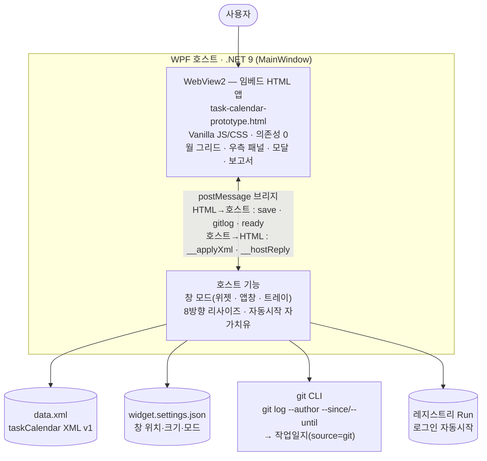

<div align="center">

# 📅 수행과제 캘린더 · TaskCalendar

**바탕화면에 상주하는 오프라인 데스크톱 캘린더 위젯 — 과제별 git 커밋으로 일/주 보고서까지 자동화**

[](#)
[](#)
[](#)
[](#)
[](#-접근성--키보드)
[](LICENSE)
[](https://github.com/Peace-Min/task-calendar/issues/new)


</div>

> [!IMPORTANT]
> **🐞 버그 · 불편한 점 · 개선 제안은 [Issues](https://github.com/Peace-Min/task-calendar/issues/new)에 등록해 주세요.**
> 쓰다가 불편하거나 깨지는 부분, "이런 기능이 있었으면" 싶은 점 — 무엇이든 이슈로 남겨주시면 확인하고 우선순위를 매겨 반영합니다. 작은 불편도 환영합니다.

---

## 목차
- [소개](#소개)
- [주요 기능](#-주요-기능)
- [시작하기](#-시작하기)
- [사용법](#-사용법)
- [아키텍처 / 구조](#️-아키텍처--구조)
- [데이터 포맷](#️-데이터-포맷)
- [접근성 · 키보드](#️-접근성--키보드)
- [로드맵](#️-로드맵)
- [이슈 · 피드백](#-이슈--피드백)
- [라이선스](#-라이선스)

---

## 소개

**수행과제 캘린더**는 인터넷 없이 동작하는 Windows 데스크톱 캘린더 위젯입니다. "수행 과제"를 카테고리로 두고 일정·할 일을 기록하며, 과제별 로컬 **git 저장소의 내 커밋을 끌어와 작업일지**로 만들고, 기간을 골라 **보고서(일간/주간) 초안**을 한 번에 뽑습니다. 데이터는 다른 소프트웨어에서도 읽기 쉬운 **XML**로 저장됩니다.

- 🔒 **완전 오프라인** — 외부 리소스·네트워크 호출 0개. 폐쇄망(망분리)에서 그대로 동작.
- 🖥️ **두 가지 창 모드** — 바탕화면 최하위 위젯(기본) ↔ 일반 앱 창(작업표시줄·Alt+Tab 노출, 트레이). ⚙에서 전환.
- 🧾 **보고서 자동화** — 과제별 git 커밋 → 작업일지 → 기간별 Markdown 보고서 초안.
- 🗂️ **개방형 데이터** — `taskCalendar` XML v1. 내보내기/가져오기로 백업·이전.
- ♿ **접근성(WCAG AA)** — 월 그리드 키보드 내비, 모달 포커스 트랩·복원, ARIA 탭/그리드, 가시 포커스 링.
- 🌗 **다크 모드** — OS 테마 자동 전환. 단색 인라인 SVG 아이콘이 currentColor로 라이트/다크 모두 적응.

> 단일 HTML(`task-calendar-prototype.html`)을 **그대로 본체로 임베드**해 WPF + WebView2 위젯으로 패키징합니다. 브라우저에서 HTML만 열어도 동일하게 동작합니다(데이터는 localStorage).

> 📖 **사용 방법**: 기능별 상세 사용법·키보드 단축키·문제 해결은 **[USAGE.md (사용 설명서)](USAGE.md)**.
> 📄 **이어서 작업하려면**: 현재 상태·빌드·배포·남은 일은 **[CHANGELOG.md](CHANGELOG.md)** (인계 문서)에.

## ✨ 주요 기능

- 🏷️ **수행 과제 관리** — 생성/수정/삭제, 색상, 과제별 **git 저장소 경로** 연결
- 🗓️ **월간 캘린더** — 월/연·월 점프, 양력 공휴일, 오늘 강조, **기간(다일) + 반복(매주/매월) 일정**(연속 막대·겹침 레인)
- ⚡ **한 줄 빠른 캡처(quick-create)** — 일정/할 일 토글 + 제목 + 날짜 + 과제(+옵션 더보기). 모든 등록·수정 진입점 일원화
- 🧩 **우측 패널 탭** — `[일정 상세 | 할 일 | 작업일지]`, 셋 다 **선택한 날짜**를 따라감. 380px에선 하단 시트
- ✅ **할 일(TODO)** — ★중요·완료 섹션·기한/기간, 캘린더에 **속 빈 링 칩**으로 표시(일정 막대와 모양으로 구분, 색맹 안전)
- 🔧 **Git 커밋 → 작업일지** — 과제별 저장소에서 `내 커밋`을 끌어와 구조화 기록으로(단건·기간 일괄)
- 📋 **보고서** — 기간 프리셋 → 과제별·날짜별 Markdown/텍스트 초안 → 복사/저장
- 🔍 **검색 / 과제별 모아보기**, 🧲 **드래그 이동**, ↔️ **너비 조절**, 🔳 **넓게 보기**
- ♿ **접근성** — 키보드 전용 조작·WCAG AA 대비·aria-live·≥40px 터치 타깃(좁은 폭)
- 🌗 **다크 모드 · 단색 아이콘 시스템 · 토스트+되돌리기 · 부팅 스켈레톤**
- 💾 **XML 내보내기/가져오기**, 자동 시작(첫 실행 1회 질문, 경로 자가 치유)

## 🚀 시작하기

> **사전 요구**: **.NET 9 SDK**(또는 .NET 9 지원 **Visual Studio 2022 17.12+**). 폐쇄망이면 [.NET 9 SDK 오프라인 설치 파일](https://dotnet.microsoft.com/download/dotnet/9.0)(x64)을 USB로 반입해 1회 설치. WebView2 NuGet은 저장소에 동봉되어 오프라인 복원됩니다.

### ① 직접 빌드
```powershell
# 프레임워크 종속(대상 PC에 .NET 9 런타임 필요, 빠름)
dotnet publish widget\TaskCalendarWidget.csproj -c Release -o dist\app

# 자체포함 단일 exe(런타임 불필요, ~171MB) — 인터넷+런타임팩 캐시 있는 빌드 PC에서
dotnet publish widget\TaskCalendarWidget.csproj -c Release -r win-x64 --self-contained true `
  -p:PublishSingleFile=true -p:IncludeNativeLibrariesForSelfExtract=true -o dist\portable
```
- 결과 실행 → 바탕화면 위젯 시작. 배포/시작프로그램/단일 exe 상세는 **[DEPLOY.md](DEPLOY.md)**.

### ② 브라우저로 바로 써보기 (빌드 없이)
- `task-calendar-prototype.html`을 더블클릭해 Edge로 열면 그대로 동작합니다(오프라인, 데이터는 localStorage).

## 📖 사용법

자주 쓰는 동작 요약 — 전체 설명·키보드 단축키·FAQ는 **[USAGE.md](USAGE.md)**.

| 동작 | 방법 |
|---|---|
| 새 일정/할 일 | 날짜 더블클릭 · 우측 **＋ 추가** · 상단 **＋ 새 기록** → **빠른 캡처**(일정/할일 토글) |
| 상세(반복·시간·기간·메모) | 빠른 캡처의 **옵션 더보기**, 또는 칩 클릭 → 편집(복잡한 건 *자세히 편집*으로 전체 편집기) |
| 우측 패널 전환 | `[일정 상세 / 할 일 / 작업일지]` 탭 — 모두 선택한 날짜 기준 |
| Git 커밋 가져오기 | **작업일지 탭**의 `이 날 커밋` / `기간 일괄` (과제에 git 경로 연결, 위젯 전용) |
| 보고서 | 우측 패널 **📋 보고서** → 기간 선택 → 복사/저장 |
| 창 모드 전환 | ⚙ → **트레이 아이콘 사용**(켜면 작업표시줄·Alt+Tab / 끄면 바탕화면 위젯) |
| 백업/이전 | ⚙(⋯) → **XML 내보내기 / 가져오기** |

## 🏗️ 아키텍처 / 구조

UI·로직은 **의존성 0의 단일 HTML**(`task-calendar-prototype.html`)에 모두 들어 있고, WPF 호스트가 이를 **WebView2로 창 100% 호스팅**합니다. HTML과 호스트는 **postMessage 브리지**로만 통신하며, 영속화·git·창 관리는 호스트가 담당합니다.



| 구성요소 | 위치 | 역할 |
|---|---|---|
| **임베드 HTML 앱** | `task-calendar-prototype.html` | 전체 UI·렌더·로직(일정·할 일·반복·보고서). 단일 ICON 맵(currentColor SVG), 디자인 토큰, 다크모드 |
| **WPF 호스트** | `widget/MainWindow.xaml.cs` | WebView2 호스팅, 창 모드(바탕화면 위젯 ↔ 앱창/트레이), 리사이즈, 자동시작 |
| **postMessage 브리지** | `window.chrome.webview` ↔ `window.__applyXml`/`__hostReply` | HTML↔호스트 비동기 통신(저장·git 조회·준비 신호·창 제어) |
| **데이터/설정** | `%APPDATA%\TaskCalendar\` | `data.xml`(개방형 XML) · `widget.settings.json` · `WebView2\`(브라우저 프로필) |
| **빌드** | `widget/TaskCalendarWidget.csproj` | HTML을 `index.html`로 EmbeddedResource 임베드 → `NavigateToString`. 단일 소스 유지 |

**기술 스택**: WPF (.NET 9, `net9.0-windows`, UseWPF+UseWindowsForms) · Microsoft.Web.WebView2 · 의존성 없는 HTML5/CSS3/ES2020 · `taskCalendar` XML v1.
**설계 메모**: Progman 자식 reparent는 WebView2 흰 화면을 유발해 미사용 — WebView2가 창을 100% 채우고(WPF 크롬 0) 타이틀바 컨트롤은 **HTML 호스트바**에 둠. 상세 인계는 [CHANGELOG.md](CHANGELOG.md), 명세는 [SPEC.md](SPEC.md), 위젯 셸은 [widget/README.md](widget/README.md).

## 🗂️ 데이터 포맷

`%APPDATA%\TaskCalendar\data.xml` 에 `taskCalendar` XML v1으로 저장(식별/날짜/플래그는 속성, 자유 텍스트는 자식 요소). 전체 스키마는 **[SPEC.md](SPEC.md)**.

```xml
<taskCalendar version="1" gitAuthor="hong@corp">
  <categories>
    <category id="c-..." color="#3e5be0" gitRepo="D:\repos\report"><name>보고서 작성</name><description/></category>
  </categories>
  <entries>
    <entry id="e-..." date="2026-06-11" categoryId="c-..." allDay="false" startTime="10:00" endTime="11:30">
      <title>요구사항 정리</title><memo/>
    </entry>
    <entry id="e-..." date="2026-06-12" categoryId="c-..." source="git" allDay="true">
      <title>리팩터링</title><memo/><commits><commit hash="..." short="abc123" time="10:00">fix: ...</commit></commits>
    </entry>
    <entry id="e-..." date="2026-06-15" endDate="2026-06-19" categoryId="c-..." allDay="true">
      <title>출장</title><memo/><recur freq="weekly" interval="1"><except date="2026-06-26"/></recur>
    </entry>
  </entries>
  <todos>
    <todo id="t-..." done="false" categoryId="c-..." due="2026-06-16" prio="high"><text>보고서 초안</text><note/></todo>
  </todos>
</taskCalendar>
```

## ⌨️ 접근성 · 키보드

마우스 없이 전체 조작 가능. 자세한 표는 [USAGE.md](USAGE.md#12-키보드-단축키).

| 영역 | 키 |
|---|---|
| 월 그리드 | `←/→` 일 이동 · `↑/↓` 주 이동 · `PageUp/Down` 월 이동 · `Home` 오늘 · `Enter/Space` 선택 |
| 전역 | `←/→`·`PageUp/Down` 월 이동 · `Home` 오늘 · `Esc` 모달/시트/넓게보기 닫기 |
| 우측 탭 | `←/→/Home/End` 탭 이동(roving) |
| 모달 | `Tab/Shift+Tab` 순환(포커스 트랩) · `Esc` 닫기 · 닫으면 호출 요소로 포커스 복원 |

- WCAG AA 대비(본문 ≥4.5:1), 가시 포커스 링, ARIA(grid·tab·dialog·status live region), `prefers-reduced-motion` 존중.

## 🗺️ 로드맵

- [x] 기간 + 반복 일정 · [x] Git 커밋 → 작업일지 + 보고서 · [x] 할 일(TODO) · [x] 트레이/창 모드 · [x] 자체포함 단일 exe
- [x] **접근성(WCAG AA)** — 키보드 그리드 내비·모달 포커스 트랩·ARIA 탭/그리드·요약 aria-live
- [x] **다크 모드** · **단색 SVG 아이콘 시스템** · 토스트+되돌리기 · 부팅 스켈레톤
- [x] 멀티데이 연속 막대(주별 레인) · 좁은 폭 바텀시트 모달 · 자동시작 경로 자가 치유
- [ ] 주간 / 일간 타임라인 뷰
- [ ] 데스크톱 알림
- [ ] 음력 명절(설·추석) 표시
- [ ] 회차별 반복 편집 · 미완료 할 일 롤오버

## 🐞 이슈 · 피드백

> [!IMPORTANT]
> **쓰면서 불편한 점, 버그, 개선 아이디어는 모두 [Issues](https://github.com/Peace-Min/task-calendar/issues/new)로 등록해 주세요.**

- 🐞 **버그 리포트** — 무엇을 하다가, 무엇을 기대했고, 실제로 어떻게 됐는지. 가능하면 화면/`%APPDATA%\TaskCalendar\widget.log` 첨부.
- 💡 **개선 제안 / 기능 요청** — "이게 있었으면", "이 동작이 어색하다" 등 사소한 불편도 환영.
- ❓ **사용 질문** — [USAGE.md](USAGE.md)·[FAQ](USAGE.md#14-문제-해결faq)를 먼저 확인 후, 안 풀리면 이슈로.

> 이슈로 모인 불편/요청은 우선순위를 매겨 반영합니다. (운영 이슈 이력: [ISSUES.md](ISSUES.md))

## 📄 라이선스

[MIT License](LICENSE) — 자유롭게 사용·수정·재배포 가능. 저작권자 표기만 유지하면 됩니다.
