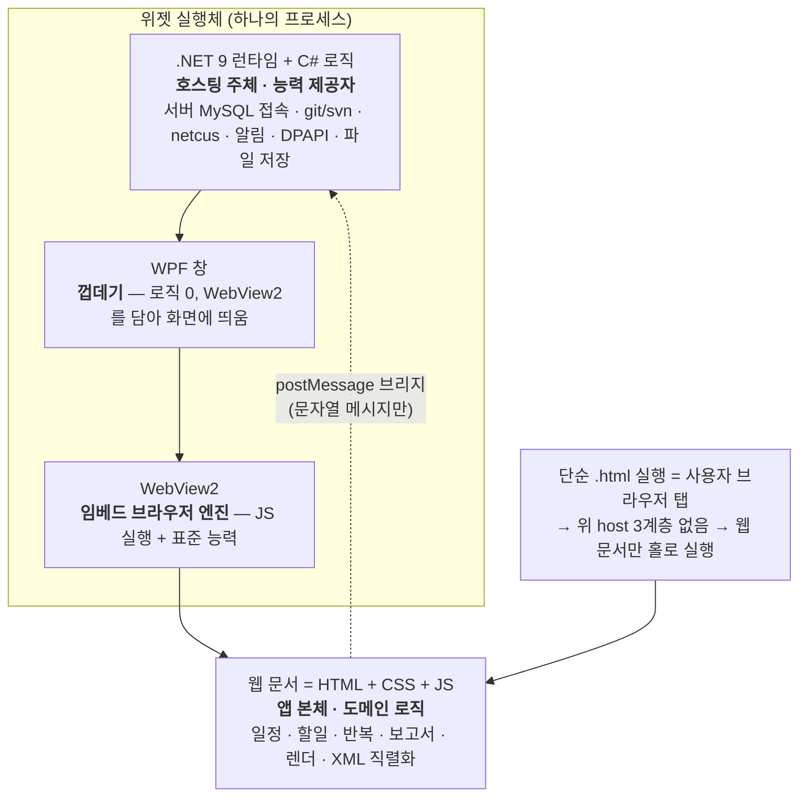
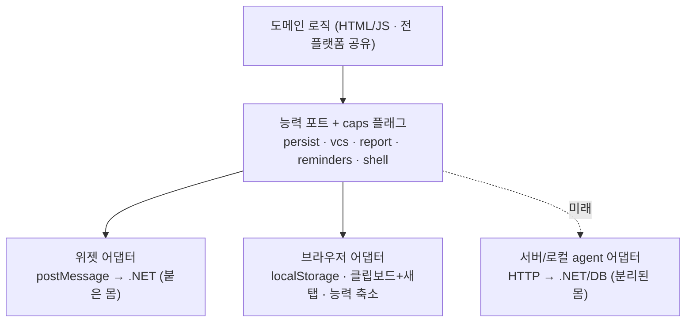

# 아키텍처 · 계층 구조 (ARCHITECTURE)

> **이 문서의 목적**: 누가 봐도 "이 앱이 어떤 계층으로 이뤄졌고, 각 로직이 왜 그 자리에 있는지, 위젯과 브라우저에서 무엇이 다른지"를 파악하게 한다. 새 기능을 어디에 넣을지 고민될 때 여기의 **배치 결정 규칙**을 조회한다.
>
> **갱신 2026-09-02.** v0.18.0에서 데이터 원본이 로컬 `data.xml`에서 **사내 서버 MySQL 직결**로 바뀌었다(`DeployConfig.XmlRetired = true`). 이 문서의 §4 포트 계약·§6 저장 위치는 그 뒤 기준이다. 왜 API 서버 없이 직결로 갔는지는 [ROADMAP.md](ROADMAP.md) §1이 정본이다.

---

## 0. 한눈 요약 (TL;DR)

- 앱 본체(UI·도메인 로직)는 **의존성 0의 단일 웹 문서**(`task-calendar-prototype.html` = HTML + CSS + JS)다.
- 위젯은 그 웹 문서를 **`.NET → WPF → WebView2`** 3계층이 감싸 호스팅하고, 브라우저가 못 하는 **OS 능력**(서버 DB 접속·git/svn·회사 보고 자동화·알림·임의 파일 저장)을 제공한다.
- **데이터 원본은 사내 서버 MySQL이다**(v0.18.0~). 위젯은 API 서버를 거치지 않고 **커넥터로 직접** 붙는다 — 그래서 신뢰 경계가 API가 아니라 **DB GRANT**다. 이건 중간 단계이며 대가는 [ROADMAP.md](ROADMAP.md) §1 표에 적혀 있다.
- 브라우저로 `.html`만 열면 그 3계층이 없다 → **도메인 로직·브라우저 표준 능력은 그대로 동작**하고, **OS 능력(서버 접속 포함)만 빠진다** → 그 브라우저의 localStorage에만 남는다.
- 그래서 로직 배치 원칙은 하나다: **"공유돼야 하면 JS, OS가 필요하면 C#(호스트), 여러 사람이 공유하면 DB(지금) / 서버 API(T2 이후)."**

---

## 1. 계층 구조



계층별 역할을 정확히:

| 계층 | 정체 | 역할 | 로직 있음? |
|---|---|---|---|
| **.NET 9 (C#)** | 런타임 + 언어 플랫폼 | **프로세스를 띄우고 호스팅**하는 주체. 브라우저가 못 하는 OS 능력을 제공하고 JS와 메시지로 통신 | **능력 로직 O**, 도메인 로직 X |
| **WPF** | Windows UI 프레임워크 | **창 껍데기** — 빈 창 + 그 창을 채운 WebView2 컨트롤 하나. 로직 없음, "담는" 역할만 | X (담는 역할만) |
| **WebView2** | 임베드 브라우저(크로미엄) 엔진 | 웹 문서를 실행하고, JS가 요청하는 **표준 능력**(사용자 파일선택·localStorage·fetch) 제공 | X (엔진) |
| **HTML + CSS + JS** | 웹 문서 = 앱 본체 | **도메인 로직 전부**(일정·할일·반복·보고서·XML 직렬화·렌더). 세 형제는 상하가 아니라 **같은 층** | **도메인 로직 O** |

> **중요**: `.NET → WPF → WebView2`는 "담고 호스팅하는" 계층이고, 마지막 `HTML+CSS+JS`는 순차가 아니라 **한 묶음(웹 문서)**이다. WPF는 "뷰어"가 아니라 능력 제공자(.NET)를 담은 창일 뿐 — 실제 능력 로직은 **.NET(C#)** 에 있다.

### C#(.NET) 쪽 능력 로직 (도메인 아님, OS 능력)

| 파일 | 담당 능력 |
|---|---|
| `widget/MainWindow.xaml.cs` | 창 모드(위젯↔앱창/트레이)·8방향 리사이즈·자동시작·자기교체·**브리지 디스패치**(포트 계약의 진입점, §4)·git CLI 실행/파싱·WebView2 부팅(가상 호스트) |
| `widget/CalendarDb.cs` | **캘린더 본체 부팅 조회** — `cal_*`를 **단일 트랜잭션·일관 스냅샷**으로 읽어 앱 state 한 덩어리로 환원. 어댑터 계약(G-0~G-7)의 구현체 |
| `widget/CalendarWriteDb.cs` | 캘린더 저장 — `saveState`(차분)·`replaceAllState`(전량 교체) 두 원시연산 |
| `widget/ReportDb.cs` | 보낸 일간·주간 보고를 `cal_report_*`에 기록 |
| `widget/ProjectDb.cs` | 공식 과제 마스터(`project`·`customer`·코드테이블) 읽기/쓰기. **쓰기 권한 판정은 `OpenWriteAsync` 한 곳**(`app_user.edit_role`·`is_active`) |
| `widget/UserSession.cs` | 로그인 세션 4필드 DPAPI 보관·복원·삭제(`user.session`). **권한은 담지 않는다** |
| `widget/RepoPaths.cs` | 과제별 git/svn 저장소 경로의 **로컬** 보관(`repo-paths.json`) — 자리마다 다르므로 **일부러 DB에 올리지 않는다** |
| `widget/DeployConfig.cs` | 배포 구성 단일 소스 — DB 접속·업데이트 소스·`XmlRetired` 스위치 |
| `widget/Svn.cs` | svn CLI 실행·XML 파싱·UTC→로컬 보정·작성자 필터·`ResolveVcs`(git/svn 분기 단일 소스) |
| `widget/NetcusService.cs` | 회사 보고 자동화(보조 WebView2로 로그인→이동→채움→제출→되읽기 검증), euc-kr 폼 우회, DPAPI 자격증명, **로그인 인증 위임** |
| `widget/Reminders.cs` | 일정 시작 알림 — 에스컬레이션 상태기계(60→30→10→5분)·Topmost 알림창·절전복귀 재평가·영속/GC |
| `widget/Update.cs` | 자동 업데이트 — `latest.json` 확인·semver 비교·다운로드·**sha256 필수 검증**·무인 설치·자기교체 |
| `widget/XlsxWriter.cs` | 의존성 0 xlsx 생성(과제 목록 Excel 추출) |

> 파일 목록은 `widget/*.cs`가 정본이다. 여기 없는 파일이 보이면 이 표가 뒤처진 것이다.

---

## 2. 두 종류의 로직 — 배치 결정 규칙

이 앱의 모든 코드는 **"도메인 로직"** 또는 **"능력 로직"** 중 하나다. 자리가 다르다.

| 로직 종류 | 자리 | 이유 |
|---|---|---|
| **도메인** — 일정·반복 전개·보고서 집계·XML 직렬화·렌더 | **HTML/JS** | 브라우저에서도 돌아야 하니, 공유 가능한 유일한 곳 |
| **능력** — **서버 DB 접속**·임의 파일 저장·git/svn·회사 보고 자동화·네이티브 알림 | **C#(호스트)** | OS·프로세스·first-party 창·TCP 소켓이 필요 (브라우저 샌드박스가 금지) |
| **공유 데이터** — 일정·할 일·과제 마스터·사용자/조직 | **중앙 MySQL** | 여러 사용자·여러 자리가 같은 것을 봐야 하니. 지금은 클라이언트 직결, T2 이후 API 경유 |

> **DB 스키마·제약은 도메인 로직인가?** 아니다 — **DB가 강제하는 것**(FK·CHECK·UNIQUE)과 **앱이 지키는 것**의 경계는 [db/CALENDAR-TABLE-DESIGN.md](../db/CALENDAR-TABLE-DESIGN.md)와 `db/deploy/schema-calendar.sql`이 정본이다. 그 경계를 JS에 복제하지 않는다(같은 규칙을 두 곳에 두지 않는다는 아래 원칙의 연장).

### 새 기능을 어디에 넣을지 — 이 순서로 판단한다

```
1. 브라우저에서도 필요한가?           → 예: JS(도메인)   ← 기본
2. (JS로는 못 하고) OS 능력이 필요한가? → 예: C#(호스트 능력) + 포트로 JS에 노출
3. 여러 사람·여러 자리가 공유해야 하나? → 예: DB 표를 늘린다(설계 문서 먼저) + C# 어댑터
```

> **핵심 원칙**: **같은 규칙을 두 곳에 두지 않는다.** 도메인 규칙을 C#·JS 양쪽에 구현하면 하나 고칠 때 둘을 고쳐야 한다(소인원 유지보수에서 가장 비싼 실수). 그래서 도메인은 JS 한 곳에 둔다.

### 예시로 확인: "XML 내보내기/불러오기"는 왜 브라우저 단독으로 되나
- XML 문자열 만들기/파싱(`toXML`/`fromXML`) = **순수 계산** → JS. *(v0.18.0에서 저장 경로가 폐기됐지만 이 둘은 남겼다 — 반출·이관의 유일한 문이기 때문이다. `DeployConfig.cs` 주석 참조.)*
- 파일 저장/열기 = **사용자가 직접 고르는** 브라우저 표준 API(`<a download>`, `<input type=file>`) → 브라우저가 허용
- 반면 **MySQL 접속**(TCP 소켓)은 브라우저가 원천 금지 → **위젯은 `MySqlConnector`, 브라우저는 `localStorage`** 로 갈린다. 그래서 브라우저 모드에는 **서버 데이터가 없다** — 능력 축소가 아니라 데이터가 다른 것이다.
- 가져오기의 **파일창을 여는 것**도 호스트 능력이다(`pickImportXml`) — `<input type=file>`은 시작 폴더를 웹이 정할 수 없어, 옮길 파일이 숨은 데이터 폴더에 있는 이관 시나리오에서 그 마찰이 그대로 미이관자 수가 된다.

즉 "브라우저가 기본 제공하는 능력 + 순수 계산"은 JS에 담으면 전 플랫폼 공유되고, **"브라우저가 막는 능력"만** 실행체(.NET)가 필요하다.

---

## 3. 위젯 vs 단순 .html — 능력 매트릭스

같은 웹 문서지만 **옆에 능력 제공자(.NET)가 붙어 있느냐**가 유일한 차이다. JS는 `HOST` 플래그로 이를 감지한다:

```js
const HOST = !!(window.chrome && window.chrome.webview);  // 위젯=true, 브라우저=false
```

| 기능 | 위젯 (`HOST=true`) | 단순 .html (`HOST=false`) | 능력 종류 |
|---|---|---|---|
| 캘린더·할일·반복·테마·검색 | ✅ | ✅ | 도메인(JS) |
| 보고서 **초안 생성** | ✅ | ✅ | 도메인(JS) |
| XML 내보내기/불러오기 | ✅ (파일창은 호스트) | ✅ (`<input type=file>`) | 브라우저 표준 |
| **데이터 저장 위치** | **사내 서버 MySQL `cal_*`** | 그 브라우저의 localStorage | **갈림 — 데이터가 공유되지 않는다** |
| **회사 계정 로그인 · 권한** | ✅ | ❌ (netcus에 CORS 없음 — 원천 불가) | OS 능력 |
| **공식 과제 마스터 · 구성원 명부** | ✅ | ❌ (DB 접속 불가) | OS 능력 |
| **git/svn 커밋 수집** | ✅ | ❌ (프로세스·로컬FS 불가) | OS 능력 |
| **회사 보고 자동 전송** | ✅ 원클릭 | ❌ 안내만(netcus 창+가이드 — 자동 작성은 same-origin 배포 시, [DECISIONS 결정5](DECISIONS.md)) | OS 능력 |
| **일정 시작 알림** | ✅ Topmost 창 | ❌ | OS 능력 |
| 바탕화면 위젯·트레이·자동시작 | ✅ | ❌ | OS 능력 |

> 브라우저는 웹 문서 한 층만 홀로 실행한다 → `window.chrome.webview`가 없어(HOST=false) 메시지를 던져도 받을 .NET이 없다 → **OS 능력만 빠지고 나머지는 그대로**.

---

## 4. 통신 = postMessage 브리지 (사실상의 포트 계약)

JS는 C# 함수를 직접 호출하지 않는다. **문자열 메시지**만 주고받는다. 이 메시지 목록이 곧 "능력 포트"의 실질 정의다.

**정본은 코드다** — `widget/MainWindow.xaml.cs`의 `OnWebMessage` `switch`(JS→호스트)와 `window.__*` 호출부(호스트→JS). 아래는 갈래별 요약이다:

| 갈래 | JS → 호스트 | 호스트 → JS |
|---|---|---|
| **데이터** | `ready` · `reloadState` · `saveState`(차분) · `replaceAllState`(전량 교체) | `__applyState` · `__applyStateError` |
| **로그인·권한** | `userLogin` · `userLogout` · `userSessionGet` · `userInfoGet` · `membersGet` | `__hostReply` |
| **과제 마스터** | `loadProjects` · `saveProject` · `loadCustomers` · `addCustomer` · `code*` · `dbInfoGet` | `__applyProjects` · `__applyCustomers` · `__applyCodes` · `__projectSaved` · `__dbInfo` |
| **VCS** | `gitlog` · `gitauthor` · `gitcheck` | `__hostReply` |
| **회사 보고** | `netcusSubmit` · `netcusWeekSubmit` · `netcusWeekMerge` · `netcusCreds*` · `netcusProbe` | `__netcus*` |
| **창·업데이트·기타** | `menu`/`pin`/`focus`/`hide`/`close` · `drag*`/`resize*` · `reminderSync` · `update*` · `pickfolder` · `pickImportXml` · `openFolder`/`openLogFolder` · `export*` | `__setPinned` · `__setTray` · `__setFocus` · `__update*` |

> **없앤 것(2026-09-01, v0.18.0)**: `save` · `backupdata`(= `data.xml` 쓰기와 그 원본 백업) · `__applyXml` · `__saveFailed` · `TC_DATA_SOURCE` 갈래. 저장은 위 **데이터** 행의 두 문으로만 간다. `saveState`와 `replaceAllState`를 굳이 나눈 이유는 **전량 교체가 되돌릴 수 없는 조작**이라 "평범한 저장"과 같은 문으로 들어오면 안 되기 때문이다 — 호출부를 눈으로 셀 수 있어야 한다.

이 계약은 **어떤 실행체가 뒤에 있든 동일하게 지킬 수 있다** — 그래서 확장의 접점이 된다(§5). 호스트가 돌려주는 state의 모양은 **어댑터 계약 G-0~G-7**이 잠그고, 그 게이트가 `tests/calendar-adapter.mjs`다.

---

## 5. 확장 로드맵 — Ports & Adapters

브라우저 탭(홀로)에 능력을 주려면 = **능력 제공자를 다시 붙이는 것**. 붙이는 위치만 다르다:



- 능력 제공자가 꼭 .NET일 필요는 없다 — **포트 계약(요청/응답 형태)만 지키면** 로컬 agent든 서버든 무엇이든 된다.
- 확장 = **어댑터 1개 작성/교체**, 도메인 코드는 무변경.
  - netcus **same-origin 배포**(ROADMAP **T1**)가 되면 → 브라우저 어댑터의 `report`만 same-origin 채움·제출로 승격([DECISIONS 결정5](DECISIONS.md) — 서버 릴레이는 자격증명 보관 리스크로 **기각**, 보고는 우리 서버를 경유하지 않음)
  - **이미 일어난 것(v0.18.0)**: 개인 데이터가 **서버 DB 단일 소스로 승격**됐다. 다만 옛 계획과 달리 **API 서버를 거치지 않고 클라이언트가 직결**하고, **로컬 캐시도 두지 않았다**(ADR-18). 위 그림의 `sadapter`가 아니라 위젯 어댑터 안쪽이 DB 커넥터로 바뀐 형태다.
  - **아직 안 온 것**: 조직이 채택(ROADMAP **T2**)하면 그때 **직결 → API 경유**로 옮긴다. 신뢰 경계가 GRANT에서 API로 이동하고, 오프라인 캐시도 그때 다시 논의한다. 지금 캐시를 만들 근거가 아니다([ROADMAP.md](ROADMAP.md) §1·§4).

### 왜 `if(HOST)` 산탄을 걷어내야 하나 (유지보수 관점)

현재 코드는 `if(HOST)`/`if(!HOST)` 분기가 여러 곳에 흩어져 있다(플랫폼 지식이 기능 코드에 새어든 상태). 여기에 브라우저 기능을 또 `if`로 얹으면 분기가 늘고, API 서버가 올 때 **모든 분기 지점을 재방문**해야 한다.

> ⚠️ **이 절은 아직 갚지 못한 부채다.** 이 문서가 "걷어내겠다"고 쓴 뒤 분기는 15곳 → 47곳으로 **늘었다**(2026-09-02 감사). 규모와 상환 순서는 [ROADMAP.md](ROADMAP.md) §3 — 특히 테스트가 함수 이름을 텍스트로 잠그고 있어(`extractFunction` 17파일) **그것부터 풀어야** 동작 불변 리팩토링이 깨지지 않는다.

목표 형태 — 기능 코드는 **플랫폼을 모르고 능력만 묻는다**:

```js
if (Platform.caps.vcs) { ... }              // if(HOST) 대체
Platform.report.submitDaily(payload);        // 위젯=postMessage / 브라우저=클립보드+새탭 / (미래)서버=fetch
```

이 규율을 지키면 **플랫폼이 늘어도 기능 코드는 그대로**, 새 플랫폼은 어댑터 하나로 흡수된다.

---

## 6. 데이터 저장 위치 요약

| 데이터 | 위젯 | 브라우저 |
|---|---|---|
| 일정·할일·과제·회의실·공수·근태·커밋 (캘린더 본체) | **사내 서버 MySQL `cal_*`** (`CalendarDb`/`CalendarWriteDb`) | 그 브라우저의 `localStorage` |
| 보낸 일간·주간 보고 기록 | 서버 `cal_report_daily`/`_hours`/`_weekly` | — (전송 자체가 없음) |
| 공식 과제 마스터·사용자·조직 | 서버 `project`·`customer`·`app_user`·`org_unit`·`title_code` | — (DB 접속 불가) |
| 창 위치·크기·모드, 알림 확인 이력 | `widget.settings.json` · `reminders.json` | — |
| **과제별 저장소 경로** | `repo-paths.json` — **일부러 로컬** (자리마다 다르다) | — |
| 테마·패널 폭 등 이 PC 한정 UI 상태 | localStorage(가상 호스트 `tcapp.local` origin) | localStorage |
| 회사 자격증명 · 로그인 세션 | `netcus.cred` · `user.session` (DPAPI 암호화) | — (해당 없음) |

> **로컬 캐시는 없다.** 서버에 못 붙으면 캘린더 본체가 **비어 있고 그 사실을 화면에 명시**한다(낡은 로컬 데이터를 보여 주지 않는다 — ADR-18과 [db/CALENDAR-TABLE-DESIGN.md](../db/CALENDAR-TABLE-DESIGN.md) §2). 그 귀결로 **서버에 못 붙은 날은 미리알림도 울리지 않는다**([ROADMAP.md](ROADMAP.md) §5 결정 2).
>
> 위젯과 브라우저는 **저장 위치가 완전히 분리**된다(공유 안 됨). 이동은 XML 내보내기/가져오기(수동)뿐. 옛 `data.xml`을 서버로 올리는 1회 이관도 같은 문을 쓴다. 상세는 [README](../README.md#️-데이터--설정-파일).

---

## 관련 문서
- **범위·YAGNI 결정 기록**: [DECISIONS.md](DECISIONS.md) · **지금 어디이고 다음이 무엇인가**: [ROADMAP.md](ROADMAP.md)
- **DB 설계 정본**: [db/CALENDAR-TABLE-DESIGN.md](../db/CALENDAR-TABLE-DESIGN.md)(캘린더 `cal_*`) · [db/ARCHITECTURE.md](../db/ARCHITECTURE.md)(과제 트랙 배포·운영) · DDL은 `db/deploy/schema-calendar.sql`·`db/schema.sql`
- 로그인·권한 관문 확정 설계: [USER-LOGIN.md](USER-LOGIN.md)
- 사용자용 개요·기능: [README.md](../README.md)
- 반출 XML 포맷·직렬화 규칙: [SPEC.md](../SPEC.md) §3
- 개발 이력: [CHANGELOG.md](../CHANGELOG.md)
