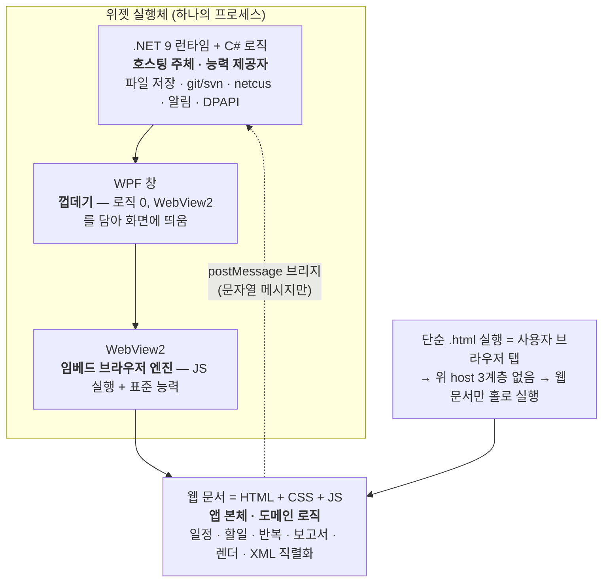
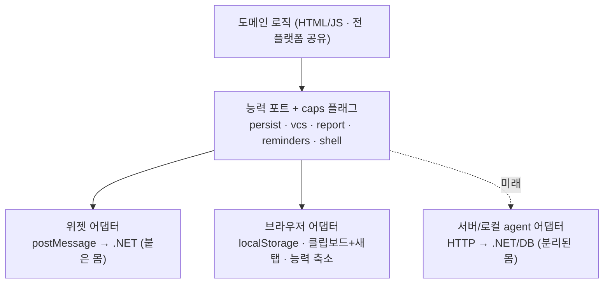

# 아키텍처 · 계층 구조 (ARCHITECTURE)

> **이 문서의 목적**: 누가 봐도 "이 앱이 어떤 계층으로 이뤄졌고, 각 로직이 왜 그 자리에 있는지, 위젯과 브라우저에서 무엇이 다른지"를 파악하게 한다. 새 기능을 어디에 넣을지 고민될 때 여기의 **배치 결정 규칙**을 조회한다.

---

## 0. 한눈 요약 (TL;DR)

- 앱 본체(UI·도메인 로직)는 **의존성 0의 단일 웹 문서**(`task-calendar-prototype.html` = HTML + CSS + JS)다.
- 위젯은 그 웹 문서를 **`.NET → WPF → WebView2`** 3계층이 감싸 호스팅하고, 브라우저가 못 하는 **OS 능력**(파일 저장·git/svn·회사 보고 자동화·알림)을 제공한다.
- 브라우저로 `.html`만 열면 그 3계층이 없다 → **도메인 로직·브라우저 표준 능력은 그대로 동작**하고, **OS 능력만 빠진다**.
- 그래서 로직 배치 원칙은 하나다: **"공유돼야 하면 JS, OS가 필요하면 C#(호스트), 여러 사람이 공유하면 (미래) 서버."**

---

## 1. 계층 구조



계층별 역할을 정확히:

| 계층 | 정체 | 역할 | 로직 있음? |
|---|---|---|---|
| **.NET 9 (C#)** | 런타임 + 언어 플랫폼 | **프로세스를 띄우고 호스팅**하는 주체. 브라우저가 못 하는 OS 능력을 제공하고 JS와 메시지로 통신 | **능력 로직 O**, 도메인 로직 X |
| **WPF** | Windows UI 프레임워크 | **창 껍데기** — 빈 창 + 그 창을 채운 WebView2 컨트롤 하나. 로직 없음, "담는" 역할만 | X (담는 역할만) |
| **WebView2** | 임베드 브라우저(크로미엄) 엔진 | 웹 문서를 실행하고, JS가 요청하는 **표준 능력**(사용자 파일선택·localStorage·fetch) 제공 | X (엔진) |
| **HTML + CSS + JS** | 웹 문서 = 앱 본체 | **도메인 로직 전부**(일정·할일·반복·보고서·XML 직렬화·렌더). 세 형제는 상하가 아니라 **같은 층** | **도메인 로직 O** |

> **중요**: `.NET → WPF → WebView2`는 "담고 호스팅하는" 계층이고, 마지막 `HTML+CSS+JS`는 순차가 아니라 **한 묶음(웹 문서)**이다. WPF는 "뷰어"가 아니라 능력 제공자(.NET)를 담은 창일 뿐 — 실제 능력 로직은 **.NET(C#)** 에 있다.

### C#(.NET) 쪽 능력 로직 (도메인 아님, OS 능력)

| 파일 | 담당 능력 |
|---|---|
| `widget/MainWindow.xaml.cs` | 창 모드(위젯↔앱창/트레이)·8방향 리사이즈·자동시작·자기교체·**원자적 파일 저장(data.xml)**·git CLI 실행/파싱·WebView2 부팅(가상 호스트) |
| `widget/Svn.cs` | svn CLI 실행·XML 파싱·UTC→로컬 보정·작성자 필터·`ResolveVcs`(git/svn 분기 단일 소스) |
| `widget/Netcus.cs` | 회사 보고 자동화(보조 WebView2로 로그인→이동→채움→제출→되읽기 검증), euc-kr 폼 우회, DPAPI 자격증명 |
| `widget/Reminders.cs` | 일정 시작 알림 — 에스컬레이션 상태기계(60→30→10→5분)·Topmost 알림창·절전복귀 재평가·영속/GC |

---

## 2. 두 종류의 로직 — 배치 결정 규칙

이 앱의 모든 코드는 **"도메인 로직"** 또는 **"능력 로직"** 중 하나다. 자리가 다르다.

| 로직 종류 | 자리 | 이유 |
|---|---|---|
| **도메인** — 일정·반복 전개·보고서 집계·XML 직렬화·렌더 | **HTML/JS** | 브라우저에서도 돌아야 하니, 공유 가능한 유일한 곳 |
| **능력** — 임의 파일 저장·git/svn·회사 보고 자동화·네이티브 알림 | **C#(호스트)** | OS·프로세스·first-party 창이 필요 (브라우저 샌드박스가 금지) |
| **팀 공유** — 팀 캘린더 집계·중앙 마스터·DB | **(미래) 서버** | 여러 사용자가 공유해야 하니 |

### 새 기능을 어디에 넣을지 — 이 순서로 판단한다

```
1. 브라우저에서도 필요한가?           → 예: JS(도메인)   ← 기본
2. (JS로는 못 하고) OS 능력이 필요한가? → 예: C#(호스트 능력) + 포트로 JS에 노출
3. 여러 사람이 공유해야 하나?          → 예: (미래) 서버
```

> **핵심 원칙**: **같은 규칙을 두 곳에 두지 않는다.** 도메인 규칙을 C#·JS 양쪽에 구현하면 하나 고칠 때 둘을 고쳐야 한다(소인원 유지보수에서 가장 비싼 실수). 그래서 도메인은 JS 한 곳에 둔다.

### 예시로 확인: "XML 내보내기/불러오기"는 왜 브라우저 단독으로 되나
- XML 문자열 만들기/파싱(`toXML`/`fromXML`) = **순수 계산** → JS
- 파일 저장/열기 = **사용자가 직접 고르는** 브라우저 표준 API(`<a download>`, `<input type=file>`) → 브라우저가 허용
- 반면 `data.xml` **자동저장**(사용자 동작 없이 고정 경로에 무단 기록)은 브라우저가 금지 → **위젯은 .NET `File.WriteAllText`, 브라우저는 `localStorage`** 로 갈린다.

즉 "브라우저가 기본 제공하는 능력 + 순수 계산"은 JS에 담으면 전 플랫폼 공유되고, **"브라우저가 막는 능력"만** 실행체(.NET/서버)가 필요하다.

---

## 3. 위젯 vs 단순 .html — 능력 매트릭스

같은 웹 문서지만 **옆에 능력 제공자(.NET)가 붙어 있느냐**가 유일한 차이다. JS는 `HOST` 플래그로 이를 감지한다:

```js
const HOST = !!(window.chrome && window.chrome.webview);  // 위젯=true, 브라우저=false
```

| 기능 | 위젯 (`HOST=true`) | 단순 .html (`HOST=false`) | 능력 종류 |
|---|---|---|---|
| 캘린더·할일·반복·테마·검색 | ✅ | ✅ | 도메인(JS) |
| 보고서 **초안 생성** | ✅ | ✅ | 도메인(JS) |
| XML 내보내기/불러오기 | ✅ | ✅ | 브라우저 표준 |
| 데이터 자동 저장 | data.xml(파일) | localStorage | 갈림 |
| **git/svn 커밋 수집** | ✅ | ❌ (프로세스·로컬FS 불가) | OS 능력 |
| **회사 보고 자동 전송** | ✅ 원클릭 | ⚠ 반자동(복사+새탭+북마클릿) | OS 능력 |
| **일정 시작 알림** | ✅ Topmost 창 | ❌ | OS 능력 |
| 바탕화면 위젯·트레이·자동시작 | ✅ | ❌ | OS 능력 |

> 브라우저는 웹 문서 한 층만 홀로 실행한다 → `window.chrome.webview`가 없어(HOST=false) 메시지를 던져도 받을 .NET이 없다 → **OS 능력만 빠지고 나머지는 그대로**.

---

## 4. 통신 = postMessage 브리지 (사실상의 포트 계약)

JS는 C# 함수를 직접 호출하지 않는다. **문자열 메시지**만 주고받는다. 이 메시지 목록이 곧 "능력 포트"의 실질 정의다.

- **JS → 호스트** (`window.chrome.webview.postMessage`): `save` · `gitlog` · `gitauthor` · `gitcheck` · `pickfolder` · `netcusSubmit` · `netcusWeekSubmit` · `netcusCreds*` · `reminderSync` · `reminderToggle` · `menu`/`pin`/`focus`/`hide`/`close`
- **호스트 → JS** (`ExecuteScriptAsync`): `__applyXml`(data.xml 주입) · `__hostReply`(요청 응답) · `__setReminders` · `__netcus*` · `__setPinned` · `__saveFailed`

이 계약은 **어떤 실행체가 뒤에 있든 동일하게 지킬 수 있다** — 그래서 확장의 접점이 된다(§5).

---

## 5. 확장 로드맵 — Ports & Adapters

브라우저 탭(홀로)에 능력을 주려면 = **능력 제공자를 다시 붙이는 것**. 붙이는 위치만 다르다:



- 능력 제공자가 꼭 .NET일 필요는 없다 — **포트 계약(요청/응답 형태)만 지키면** 로컬 agent든 서버든 무엇이든 된다.
- 확장 = **어댑터 1개 작성/교체**, 도메인 코드는 무변경.
  - 서버 릴레이가 생기면 → 브라우저 어댑터의 `report`만 자동화로 승격
  - 팀 공유 DB가 오면 → `masterData` 포트 추가(조직·과제는 서버, 개인은 로컬 유지 — 하이브리드)

### 왜 `if(HOST)` 산탄을 걷어내야 하나 (유지보수 관점)

현재 코드는 `if(HOST)`/`if(!HOST)` 분기가 여러 곳에 흩어져 있다(플랫폼 지식이 기능 코드에 새어든 상태). 여기에 브라우저 기능을 또 `if`로 얹으면 분기가 늘고, 서버·DB가 올 때 **모든 분기 지점을 재방문**해야 한다.

목표 형태 — 기능 코드는 **플랫폼을 모르고 능력만 묻는다**:

```js
if (Platform.caps.vcs) { ... }              // if(HOST) 대체
Platform.report.submitDaily(payload);        // 위젯=postMessage / 브라우저=클립보드+새탭 / (미래)서버=fetch
```

이 규율을 지키면 **플랫폼이 늘어도 기능 코드는 그대로**, 새 플랫폼은 어댑터 하나로 흡수된다.

---

## 6. 데이터 저장 위치 요약

| 데이터 | 위젯 | 브라우저 |
|---|---|---|
| 일정·할일·과제·회의실 (캘린더 본체) | `%APPDATA%\TaskCalendar\data.xml` (호스트 원자적 기록) | 그 브라우저의 `localStorage` |
| 설정·테마·근태·패치노트 '본 버전' | localStorage(가상 호스트 `tcapp.local` origin) + 일부 data.xml | localStorage |
| 회사 자격증명 | `netcus.cred` (DPAPI 암호화) | — (해당 없음) |

> 위젯과 브라우저는 **저장 위치가 완전히 분리**된다(공유 안 됨). 이동은 XML 내보내기/불러오기(수동)뿐. 상세는 [README](../README.md#️-데이터--설정-파일).

---

## 관련 문서
- **범위·YAGNI 결정 기록**: [DECISIONS.md](DECISIONS.md) · **현재 수준↔최종 그림·승격 단계**: [ROADMAP.md](ROADMAP.md)
- 사용자용 개요·기능: [README.md](../README.md)
- 데이터 스키마·직렬화 규칙: [SPEC.md](../SPEC.md)
- 변경 이력(인계): [CHANGELOG.md](../CHANGELOG.md)
